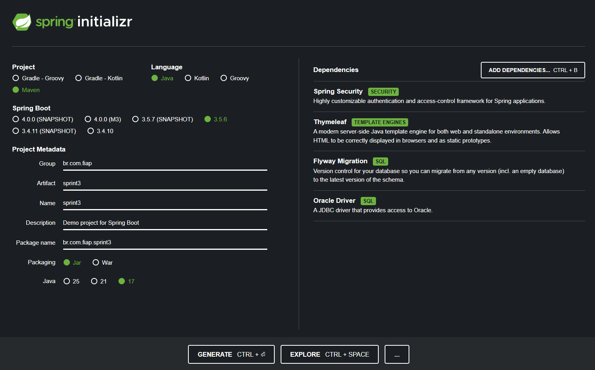

# MottuMap
 
MottuMap é um projeto que utiliza visão computacional e tecnologia RFID para facilitar a localização e a gestão das motos nos pátios da Mottu.
 
Cada moto será equipada com uma etiqueta RFID, que ao ser lida por sensores instalados nas zonas do pátio, gera um novo registro no histórico de movimentação da moto. Isso permite rastrear em tempo real a zona em que a moto está localizada.
 
Além disso, para uma identificação ainda mais precisa, o sistema conta com câmeras de visão computacional que mapeiam as vagas dentro de cada zona, permitindo associar a moto a uma posição específica (vaga) dentro da zona.
 
Com isso, será possível acompanhar o histórico de movimentação de cada moto, sabendo por onde ela passou e onde está atualmente.

**Esta API desenvolvida com Spring Boot conta com**: um sistema de Login e Logout, usuários salvos no banco, gerenciamento de entidades pela Web, versionamento do banco de dados e mais tecnologias, acompanhe a documentação completa abaixo.
 
---
 
## Interface Web

Veja abaixo como ficou o resultado das telas para gerenciar cada uma das entidades (Cadastro e Listagem).
- É possível editar ou excluir registros. 
- O formulário de cadastro/edição conta com validação nos campos.


---

## Acesso / Usuários

Foram definidos dois usuários, assim que a aplicação inicia, através de Migrations com **Flyway**:
- **ADMIN:** tem permissão pra fazer o CRUD completo e acessar todas as telas do sistema.
- **USER:** só pode acessar páginas de listagem e fazer requisições do tipo GET. 

Para acessar as telas, basta logar com um desses usuários:
| Email             | Senha     | Role (permissão)  |
| ----------------- | --------- | ----------------- |
| admin@mottu.com   | 123456    | ADMIN             |
| user@mottu.com    | 123456    | USER              |


Para acessar via Postman, coloque o Email e Senha na sessão de Basic Auth antes de cada requisição:


**Obs:** todos os endpoints são acessados via **`localhost:8080`**

---

## Configuração do Spring Initializr (dependências adicionadas para a Sprint 3)

 
**Dependências:**
- Spring Web: Por se tratar de uma API Rest.
- Spring Boot DevTools: Recursos que ajudam na produtividade.
- Spring Data JPA: Acessar e manipular bancos de dados.
- Lombok: Gerar automaticamente códigos repetitivos (mais otimizado).
- Validation: Biblioteca de validação usada nos DTOs.
- Oracle Driver: Banco de dados Oracle.
- Thymeleaf: Renderização de página HTML no navegador.
- Spring Security: Autenticação e acesso aos endpoints.
- Flyway: Versionamento do banco de dados.
 
**Estrutura do Banco de Dados:**

 
**Entidades:** Patio, Zona, Moto, Sensor, Historico
 
---
 
## Pacotes utilizados e suas funções
 
### Arquitetura: MVC
 
**1. Model:**
- Entity → Mapeia tabelas e relacionamentos no banco.
- Repository → Abstrai o acesso e consultas ao banco.
- Service → Implementa lógica e regras de negócio.
- Exception → Constrói exceptions personalizadas.
- DTO → Definição dos modelos de Request e Response de cada entidade.
 
**2. View:**
- Static → CSS, JS e imagens
- Templates → Fragmentos e Páginas HTML
 
**3. Controller:**
- Controller HTTP → Expõe endpoints REST e manipula requisições/respostas.
- Controller WEB → Expõe endpoints e mapeia páginas WEB.
 
---
 
 
## Endpoints
 
### JSON:
 
**1. Patio:**
 
| Método | URI            | Descrição                   |
| ------ | -------------- | --------------------------- |
| GET    | `/api/patios`      | Lista todos os pátios       |
| GET    | `/api/patios/{id}` | Busca um pátio pelo ID      |
| POST   | `/api/patios`      | Cria um novo pátio          |
| PUT    | `/api/patios/{id}` | Atualiza um pátio existente |
| DELETE | `/api/patios/{id}` | Deleta um pátio pelo ID     |
 
**2. Zona:**
 
| Método | URI           | Descrição                   |
| ------ | ------------- | --------------------------- |
| GET    | `/api/zonas`      | Lista todas as zonas        |
| GET    | `/api/zonas/{id}` | Busca uma zona pelo ID      |
| POST   | `/api/zonas`      | Cria uma nova zona          |
| PUT    | `/api/zonas/{id}` | Atualiza uma zona existente |
| DELETE | `/api/zonas/{id}` | Deleta uma zona pelo ID     |
 
**3. Moto:**
 
| Método | URI                            | Descrição                                        |
| ------ | ------------------------------ | ------------------------------------------------ |
| GET    | `/api/motos`                       | Lista todas as motos                             |
| GET    | `/api/motos/{id}`                  | Busca uma moto pelo ID                           |
| GET    | `/api/motos/buscar?marca=&modelo=` | Busca motos por marca e/ou modelo (query params) |
| POST   | `/api/motos`                       | Cria uma nova moto                               |
| PUT    | `/api/motos/{id}`                  | Atualiza uma moto existente                      |
| DELETE | `/api/motos/{id}`                  | Deleta uma moto pelo ID                          |
 
**4. Sensor:**
| Método | URI              | Descrição                    |
| ------ | ---------------- | ---------------------------- |
| GET    | `/api/sensores`      | Lista todos os sensores      |
| GET    | `/api/sensores/{id}` | Busca um sensor pelo ID      |
| POST   | `/api/sensores`      | Cria um novo sensor          |
| PUT    | `/api/sensores/{id}` | Atualiza um sensor existente |
| DELETE | `/api/sensores/{id}` | Deleta um sensor pelo ID     |
 
**5. Historico:**
| Método | URI                         | Descrição                               |
| ------ | --------------------------- | --------------------------------------- |
| GET    | `/api/historicos`               | Lista todos os históricos               |
| GET    | `/api/historicos/{id}`          | Busca um histórico pelo ID              |
| GET    | `/api/historicos/moto/{motoId}` | Lista históricos de uma moto específica |
| POST   | `/api/historicos`               | Cria um novo registro de histórico      |
| PUT    | `/api/historicos/{id}`          | Atualiza um histórico existente         |
| DELETE | `/api/historicos/{id}`          | Deleta um histórico pelo ID             |
 
---
 
### HTML:
 
**1. Patio:**
 
| Método | URI                       | Descrição                                       | View retornada            |
|--------|---------------------------|-------------------------------------------------|---------------------------|
| GET    | `/web/patios/listar`      | Lista todos os patios                           | `patio/patio-lista`      |
| GET    | `/web/patios/cadastrar`  | Exibe o formulário de cadastro/edição           | `patio/patio-form`        |
| GET    | `/web/patios/editar/{id}` | Exibe o formulário preenchido para edição       | `patio/patio-form`        |
| POST   | `/web/patios/salvar`      | Cadastra pátio (novo ou edição) e redireciona      | Redirect → `/listar`      |
| GET    | `/web/patios/excluir/{id}`| Exclui pátio e redireciona para listagem        | Redirect → `/listar`      |
 
**2. Zona:**
 
| Método | URI                       | Descrição                                       | View retornada            |
|--------|---------------------------|-------------------------------------------------|---------------------------|
| GET    | `/web/zonas/listar`      | Lista todas as zonas                           | `zona/zona-lista`      |
| GET    | `/web/zonas/cadastrar`  | Exibe o formulário de cadastro/edição           | `zona/zona-form`        |
| GET    | `/web/zonas/editar/{id}` | Exibe o formulário preenchido para edição       | `zona/zona-form`        |
| POST   | `/web/zonas/salvar`      | Cadastra zona (novo ou edição) e redireciona      | Redirect → `/listar`      |
| GET    | `/web/zonas/excluir/{id}`| Exclui zona e redireciona para listagem        | Redirect → `/listar`      |
 
**3. Moto:**
 
| Método | URI                       | Descrição                                       | View retornada            |
|--------|---------------------------|-------------------------------------------------|---------------------------|
| GET    | `/web/motos/listar`      | Lista todas as motos                           | `moto/moto-lista`      |
| GET    | `/web/motos/cadastrar`  | Exibe o formulário de cadastro/edição           | `moto/moto-form`        |
| GET    | `/web/motos/editar/{id}` | Exibe o formulário preenchido para edição       | `moto/moto-form`        |
| POST   | `/web/motos/salvar`      | Cadastra motos (novo ou edição) e redireciona      | Redirect → `/listar`      |
| GET    | `/web/motos/excluir/{id}`| Exclui motos e redireciona para listagem        | Redirect → `/listar`      |
 
 
**4. Sensor:**
 
| Método | URI                       | Descrição                                       | View retornada            |
|--------|---------------------------|-------------------------------------------------|---------------------------|
| GET    | `/web/sensores/listar`      | Listar todos os sensores                           | `sensor/sensor-lista`      |
| GET    | `/web/sensores/cadastrar`  | Exibe o formulário de cadastro/edição           | `sensor/sensor-form`        |
| GET    | `/web/sensores/editar/{id}` | Exibe o formulário preenchido para edição       | `sensor/sensor-form`        |
| POST   | `/web/sensores/salvar`      | Cadastra sensores (novo ou edição) e redireciona      | Redirect → `/listar`      |
| GET    | `/web/sensores/excluir/{id}`| Exclui sensor e redireciona para listagem        | Redirect → `/listar`      |
 
 
**5. Historico:**
 
| Método | URI                       | Descrição                                       | View retornada            |
|--------|---------------------------|-------------------------------------------------|---------------------------|
| GET    | `/web/historicos/listar`      | Lista todos os historicos                           | `historico/historico-lista`      |
| GET    | `/web/historicos/cadastrar`  | Exibe o formulário de cadastro/edição           | `historico/historico-form`        |
| GET    | `/web/historicos/editar/{id}` | Exibe o formulário preenchido para edição       | `historico/historico-form`        |
| POST   | `/web/historicos/salvar`      | Cadastra histórico (novo ou edição) e redireciona      | Redirect → `/listar`      |
| GET    | `/web/historicos/excluir/{id}`| Exclui histórico e redireciona para listagem        | Redirect → `/listar`      |
 
 
 
---
 
 
## Exemplos de Requisições
 
- Exemplo de Request **Patio**:
````json
{
    "nome": "Mottu Space 3",
    "endereco": "Av. Butantan, 552"
}
````
 
 
- Exemplo de Request **Zona**:
````json
{
    "tipo": "Reparo",
    "qtdVaga": 10,
    "patioId": 1
}
````
 
- Exemplo de Request **Moto**:
````json
{
    "placa": "1234567",
    "chassi": "12345678901234567",
    "modelo": "Pop"
}
````
 
- Exemplo de Request **Sensor**:
````json
{
  "localizacao": "Entrada principal",
  "data": "2025-05-23",
  "hora": "22:30"
}
````
 
- Exemplo de Request **Historico**:
````json
{
  "posicao": 2,
  "motoId": 2,
  "zonaId": 1,
  "sensorId": 2
}
````
 
---
 
## Instruções para Executar o Projeto
 
1. Faça o clone desse repositório (```git clone https://github.com/eduardogdias/java_sprint3.git```);
2. Tenha pelo menos o Java 17 (o projeto foi desenvolvido usando essa versão);
3. Abra ele em sua IDE de preferência;
4. Coloque as credenciais do Oracle (usuário e senha) no application.properties;
5. Dê um Run na classe "Sprint3Application.java";
6. Teste as requisições no Postman/Insomnia ou acessando via Web pelo `localhost:8080`.
 
---
 
## Visão Geral do Projeto
 

 
---
 
## Contato

Para dúvidas, melhorias ou sugestões relacionadas ao projeto, entre em contato :)