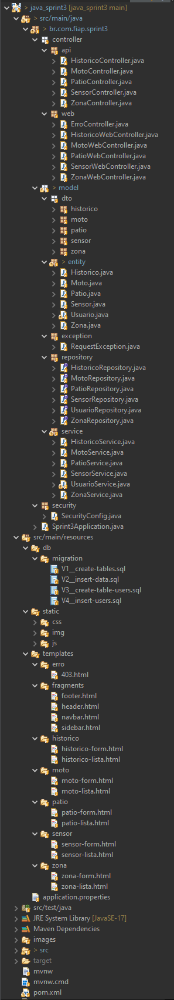

**Obs:** Esse repositório foi usado para as entregas das disciplinas: Java e DevOps.
---

# MottuMap

MottuMap é um projeto desenvolvido com visão computacional e leitura RFID para facilitar a localização e gestão das motos nos páitos da Mottu.

---

**Descrição do Projeto**

Cada moto será equipada com uma etiqueta RFID, que ao ser lida por sensores instalados nas zonas do pátio, gera um novo registro no histórico de movimentação da moto. Isso permite rastrear em tempo real a zona atual onde a moto está localizada.

Além disso, para uma identificação ainda mais precisa, o sistema conta com câmeras de visão computacional que mapeiam as vagas dentro de cada zona,  permitindo associar a moto a uma posição específica (vaga) dentro da zona.

Com isso, é possível acompanhar o histórico de movimentação de cada moto, sabendo por onde ela passou e onde está atualmente.

---

## Especificação do projeto:


**Dependências:**
- Spring Web: Por se tratar de uma API Rest;
- Spring Boot DevTools: Recursos que ajudam na produtividade;
- Spring Data JPA: Acessar e manipular bancos de dados;
- H2 Database: Banco de dados em memória;
- Lombok: Gerar automaticamente códigos repetitivos (mais otimizado);
- Validation: Validações com Bean Validation usadas nos DTOs.

**Estrutura do Banco de Dados:**


**Entidades:** Patio, Zona, Moto, Sensor, Historico

- Pátio (1) ↔ (N) Zona:
Um pátio pode conter várias zonas.
Cada zona pertence a um único pátio.

- Zona (1) ↔ (N) Histórico:
Uma zona pode estar presente em vários registros de histórico.
Cada histórico está vinculado a uma única zona.

- Moto (1) ↔ (N) Histórico:
Uma moto pode ter vários registros de histórico.
Cada histórico está associado a uma única moto.

- Sensor (1) ↔ (N) Histórico:
Um sensor pode registrar vários históricos.
Cada histórico é registrado por um único sensor.

---

## Endpoints

**1. Patio:**

| Método | URI            | Descrição                   |
| ------ | -------------- | --------------------------- |
| GET    | `/patios`      | Lista todos os pátios       |
| GET    | `/patios/{id}` | Busca um pátio pelo ID      |
| POST   | `/patios`      | Cria um novo pátio          |
| PUT    | `/patios/{id}` | Atualiza um pátio existente |
| DELETE | `/patios/{id}` | Deleta um pátio pelo ID     |

**2. Zona:**

| Método | URI           | Descrição                   |
| ------ | ------------- | --------------------------- |
| GET    | `/zonas`      | Lista todas as zonas        |
| GET    | `/zonas/{id}` | Busca uma zona pelo ID      |
| POST   | `/zonas`      | Cria uma nova zona          |
| PUT    | `/zonas/{id}` | Atualiza uma zona existente |
| DELETE | `/zonas/{id}` | Deleta uma zona pelo ID     |

**3. Moto:**

| Método | URI                            | Descrição                                        |
| ------ | ------------------------------ | ------------------------------------------------ |
| GET    | `/motos`                       | Lista todas as motos                             |
| GET    | `/motos/{id}`                  | Busca uma moto pelo ID                           |
| GET    | `/motos/buscar?marca=&modelo=` | Busca motos por marca e/ou modelo (query params) |
| POST   | `/motos`                       | Cria uma nova moto                               |
| PUT    | `/motos/{id}`                  | Atualiza uma moto existente                      |
| DELETE | `/motos/{id}`                  | Deleta uma moto pelo ID                          |

**4. Sensor:**
| Método | URI              | Descrição                    |
| ------ | ---------------- | ---------------------------- |
| GET    | `/sensores`      | Lista todos os sensores      |
| GET    | `/sensores/{id}` | Busca um sensor pelo ID      |
| POST   | `/sensores`      | Cria um novo sensor          |
| PUT    | `/sensores/{id}` | Atualiza um sensor existente |
| DELETE | `/sensores/{id}` | Deleta um sensor pelo ID     |

**5. Historico:**
| Método | URI                         | Descrição                               |
| ------ | --------------------------- | --------------------------------------- |
| GET    | `/historicos`               | Lista todos os históricos               |
| GET    | `/historicos/{id}`          | Busca um histórico pelo ID              |
| GET    | `/historicos/moto/{motoId}` | Lista históricos de uma moto específica |
| POST   | `/historicos`               | Cria um novo registro de histórico      |
| PUT    | `/historicos/{id}`          | Atualiza um histórico existente         |
| DELETE | `/historicos/{id}`          | Deleta um histórico pelo ID             |

---

## Utilização de DTOs e Bean Validation


Os DTOs foram utilizados para validar as request (RequestDTO) e enviar responses (ResponseDTO) personalizadas (ocultando ou incluindo automaticamente dados).

**Exemplo 1:**

Sem o PatioResponseDTO:


Com o PatioResponseDTO:


**Exemplo 2:**

Note que foram passados apenas: tipo, qtdVaga e patioId no body, e a response já mostra o pátio que essa zona está e o nome do mesmo.


A mesma coisa acontece com o GET, pois a ZonaResponseDTO foi configurada para ter esse retorno personalizado.


**Exemplo 3:**

Ao cadastrar uma moto, a marca é cadastrada automaticamente de acordo o modelo da mesma. Novamente utilizando DTOs para isso.


**Exemplo 4:**

Ainda sobre os DTOs, no caso das motos optamos por deixar a “placa” e “chassi” como opcionais. Pois uma moto pode chegar sem placa ou com o número de chassi raspado. Só que não é permitido cadastrar uma moto sem nenhuma das duas informações.


--- 

## Boas Práticas e Otimizações
Foram utilizadas duas annotation importantes visando a melhor performance do projeto: ``Cascade`` e ``Fetch``.
Ainda na relação de Patio e Zonas, se um Patio for excluído, todas as zonas associadas a ele também serão deletadas. E foi usado ``FetchType.LAZY`` para que o projeto carregue apenas os dados da tabela que será usada no momento.
Ao chamar uma Zona, por exemplo, não serão carregadas as informações de Patio, graças ao ``Fetch Lazy``.

**Zona**:
````java
@ManyToOne(fetch = FetchType.LAZY)
@JoinColumn(name = "fk_patio", nullable = false) // a zona deve um ter patio para ser instanciada
@NotNull(message = "O pátio da zona é obrigatório")
private Patio patio;
````

**Patio**:

````java
@OneToMany(mappedBy = "patio", cascade = CascadeType.REMOVE, fetch = FetchType.LAZY)
private List<Zona> zonas;
````
---

## Exemplos de Requisições

Acesse a Collection do Postman com as requisições já monstadas: 
``https://www.postman.com/altimetry-astronaut-50480178/workspace/my-workspace/collection/38977802-fcc00167-f9e8-49fd-b45d-4c48548575d1?action=share&creator=38977802``
- Exemplo de Request **Patio**:
````json
{
    "nome": "Mottu Space 3",
    "endereco": "Av. Butantan, 552"
}
````


- Exemplo de Request **Zona**:
````json
{
    "tipo": "Reparo",
    "qtdVaga": 10,
    "patioId": 1
}
````

- Exemplo de Request **Moto**:
````json
{
    "placa": "1234567",
    "chassi": "12345678901234567",
    "modelo": "Pop"
}
````

- Exemplo de Request **Sensor**:
````json
{
  "localizacao": "Entrada principal",
  "data": "2025-05-23",
  "hora": "22:30"
}
````

- Exemplo de Request **Historico**:
````json
{
  "posicao": 2,
  "motoId": 2,
  "zonaId": 1,
  "sensorId": 3
}
````

---

## Busca por Parâmetros 

Em todas tabelas é possível fazer uma busca por ID (path params).
Também adicionamos a busca com Query Params, que foram adicionados para na listagem de motos. Sendo possível filtrar a pesquisa por **modelo** ou **marca** da moto.


--- 

## Tratamento de Exceções

Foi criada uma classe responsável por receber e montar um retorno personalizado em caso de responses ``404`` (Not Found) e ``400`` (Bad Request).


---

## Instruções para Executar o Projeto (JAVA ADVANCED)

1. Faça o clone desse repositório (```git clone https://github.com/eduardogdias/java_sprint1.git```);
2. Tenha pelo menos o Java 17 (o projeto foi desenvolvido usando essa versão);
3. Abra ele em sua IDE de preferência;
4. Dê um Run na classe "Sprint1Application";
5. Teste as requisições no Postman/Insomnia.

**Observações:**
1. Não é necessário passar suas crenciais do banco, pois o projeto utiliza o H2;
2. Acesse a Collection do Postman com as requisições prontas: 
``https://www.postman.com/altimetry-astronaut-50480178/workspace/my-workspace/collection/38977802-fcc00167-f9e8-49fd-b45d-4c48548575d1?action=share&creator=38977802``
2. Para criar a **Zona**, ela deve estar associada a um **Patio**;
3. Para criar um **Historico**, é necessário criar: **Moto**, **Zona** e **Sensor**.

---

## Visão Geral do Projeto



---

## Instruções para Executar o Projeto (DEVOPS TOOLS And CLOUD COMPUTING):

**1.** No Azure CLI, vamos criar e configurar nossa VM. Digite esses 3 comandos no terminal:
````sh
git clone https://github.com/eduardogdias/java_sprint1.git
chmod 744 java_sprint1/criar-vm-sprint1-git-nano-docker.sh
./java_sprint1/criar-vm-sprint1-git-nano-docker.sh
````


**2.** Faça uma conexão SSH com sua VM, digite 'yes' para confiar, e coloque sua senha após isso:
````sh
ssh admlnx@IpVM
````

**3.** O Git, Nano e Docker já vieram instalados e configurados pelo script de criação da VM:


**4.** Crie a rede para agrupar os dois containers que serão usados:
````sh
docker network create sprint1-network
````

**5.** Clone o projeto dentro da VM:
````sh
git clone https://github.com/eduardogdias/java_sprint1.git
cd java_sprint1
````

**6.** Veja que há dois Dockerfiles, que serão usados em cada um dos containers, vamos "buildar" essas imagens:


````sh
docker build -t image-api .
````
````sh
docker build -f Dockerfile-insert -t image-curl .
````


**7.** Agora, crie os dois container usando as imagens "buildadas":
````sh
docker run -d --name container-api -p 8080:8080 --network sprint1-network image-api
````
A partir da execução do código acima, já é possível acessar a API (via Postman, por exemplo) utilizando o IP da VM e a porta 8080.
O código abaixo executa o container responsável por realizar os inserts em todas as tabelas da API:

````sh
docker run -it --name container-curl --network sprint1-network image-curl sh
````


